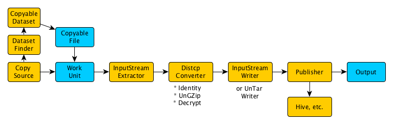

# Table of Contents

[TOC]

# Introduction

Gobblin Distcp is a rebuilding of [Distcp](https://hadoop.apache.org/docs/current/hadoop-distcp/DistCp.html) on top of Gobblin. It is still currently a work in progress, but an Alpha version of the code is available. The document mainly outlines the design of Gobblin Distcp, including the high level design goals and core APIs.

Gobblin Distcp benefits from many features in Gobblin:

* Dataset awareness
    * Configurability/customization of replication flows (Planned)
    * Isolation (Implemented)
    * Support for flexible copy triggering semantics (data triggers, dataset descriptors, etc.) (Planned)
    * Future support for self-serve replication (Planned)
* Operability
    * Metrics (Implemented)
* Customizable publish semantics
    * Data triggers (Implemented)
    * Hive registration (Implemented)
    * Auditing (Planned)
    * Exactly-once publishing (Planned)
* Future support for continuous execution (near-real-time replication) (Planned)
* Inline byte stream processing
    * Archiving/unarchiving (Implemented)
    * Encryption/decryption (Implemented)

The effort uses a regular Gobblin workflow with specific constructs that handle input streams as records. We use gobblin data management to have dataset awareness, and to optimize copy listings where possible. We use gobblin metrics to emit data availability notifications and operational metrics. 

# Problem Statement

We need an application for copying from a FileSystem compatible source to another FileSystem compatible destination. The application must be able to:

1. Find files in source FileSystem A that need to be copied.
2. Determine locations in FileSystem B where the new files will be created.
3. Do byte level copy from file in A to file in B efficiently.
4. Be simple enough for other users to use it instead of distcp.
5. Set owner, group, and permissions of newly created files, as well as newly created ancestors.
6. On user request, override default attributes of new files like block size, replication factor, etc.
7. Allow for on-the-fly byte level transformations like UnGZippping, PGP decrypting, etc.
8. Allow for on-the-fly unpacking of byte streams, like expanding tarballs, zips, etc.
9. Perform quality checks on the destination files if requested.
10. Emit real-time operational metrics (transfer speed, files completed, etc.) and allow for creating post-job summaries.
11. Emit data availability notifications.
12. Copy listings should be pluggable and fully dataset aware. Datasets can annotate data availability notifications, or modify aspects of the copy operation (like preserve attributes).
13. Publishing should be pluggable and allow for easy extensions. Default publishing will simply place files in correct target locations. Extensions can register new files with Hive, etc.
14. Reuse previously copied files that didn’t get published due to errors in the previous flow.
15. Use other Gobblin features (e.g. proxying, password management).

# Existing Solutions

* [Distcp](https://hadoop.apache.org/docs/current/hadoop-distcp/DistCp.html): Tool maintained by Hadoop. Allows copying files and syncing directories between FileSystem implementations (including HDFS, S3, and local file systems). Uses MapReduce to perform the copy. Has various features like preserving permissions and setting replication factors.
    * Uses some heuristics to accelerate file listing generation (e.g. using directory mod time to determine if new files are likely to exist).
    * Minimally dataset aware: e.g. can treat tracking and databases data differently.
    * Can recover files that failed to publish in previous runs.
* Gobblin: Regular Gobblin can be used to read every record and re-write it to the new location. However, this involves actually deserializing records and has significant overhead. 

# Proposed Design

## Design Overview

The core of Gobblin distcp is simply a traditional Gobblin flow with sources, converters, and writers that work directly with input streams. The work units are CopyableFiles, which contain all the metadata necessary to copy a single file, and the records are FileAwareInputStream, which is an input stream + CopyableFile. 



### Example

1. `CopySource` runs a `DatasetFinder`.
2. `DatasetFinder` searches for all `Dataset`s.
3. It creates a `CopyableDataset` for each `Dataset`.
4. Each `Dataset` creates a copy listing for itself.
5. `CopySource` creates a Gobblin `WorkUnit` for each `CopyableFile`.
6. `InputStreamExtractor` opens an `InputStream` for each `CopyableFile`.
7. `InputStreamWriter` creates the necessary file in destination and dumps the bytes of the `InputStream`.
8. `InputStreamWriter` sets the correct owner and permissions, and puts files in writer-output location in the same directory structure as they will be published.
9. `DataPublisher` groups work units by partition string and, for each partition string, moves the files to the destination. If a partition of a dataset failed to copy, all other successful partitions and datasets are published either way. The failed partition is staged for recovery on next run.
10. `DataPublisher` emits notifications, performs Hive registration, etc.

## Classes

### CopyableDataset

* An abstraction of a `Dataset`, i.e. a set of related files (for example a database table).
* Generates copy listings for that dataset. Example: if I want to replicate DB.Table to a new location, which files should I copy.
* Generates partitioning of copy listing into atomic units called file sets. A file set will be published nearly atomically.
* All files in the listing will be copied. It is the responsibility of the `CopyableDataset` to do a diff with the target (because it might have optimizations for performing the diff).
* Implementations:
    * `RecursiveCopyableDataset`: copies all files under an root directory.
    * `StreamDataset`: copies date-partitioned directories for Kafka topics.

```
/**
* Interface representing a dataset.
*/
public interface Dataset {
 
 /**
  * Deepest {@link org.apache.hadoop.fs.Path} that contains all files in the dataset.
  */
 public Path datasetRoot();

}

/**
 * {@link Dataset} that supports finding {@link CopyableFile}s.
 */
public interface CopyableDataset extends Dataset {

 /**
  * Find all {@link CopyableFile}s in this dataset.
  *
  * <p>
  *   This method should return a collection of {@link CopyableFile}, each describing one file that should be copied
  *   to the target. The returned collection should contain exactly one {@link CopyableFile} per file that should
  *   be copied. Directories are created automatically, the returned collection should not include any directories.
  *   See {@link CopyableFile} for explanation of the information contained in the {@link CopyableFile}s.
  * </p>
  *
  * @param targetFs target {@link FileSystem} where copied files will be placed.
  * @param configuration {@link CopyConfiguration} for this job. See {@link CopyConfiguration}.
  * @return List of {@link CopyableFile}s in this dataset.
  * @throws IOException
  */
 public Collection<CopyableFile> getCopyableFiles(FileSystem targetFs, CopyConfiguration configuration) throws
     IOException;

}
```

### DatasetFinder

* Finds `CopyableDataset`s in the file system. 
* Implementations:
    * `CopyableGlobDatasetFinder`: Uses a glob and creates a` RecursiveCopyableDataset` for each matching directory.
    * `StreamDatasetFinder`: Creates a `StreamDataset `for each directory in input directory.

```
/**
 * Finds {@link Dataset}s in the file system.
 *
 * <p>
 *   Concrete subclasses should have a constructor with signature
 *   ({@link org.apache.hadoop.fs.FileSystem}, {@link java.util.Properties}).
 * </p>
 */
public interface DatasetsFinder<T extends Dataset> {

 /**
  * Find all {@link Dataset}s in the file system.
  * @return List of {@link Dataset}s in the file system.
  * @throws IOException
  */
 public List<T> findDatasets() throws IOException;

 /**
  * @return The deepest common root shared by all {@link Dataset}s root paths returned by this finder.
  */
 public Path commonDatasetRoot();

}
```

### CopyableFile

* Structure containing information about a file that needs to be copied:
    * Origin `FileStatus`.
    * Destination path.
    * Desired owner and permission.
    * Attributes to be preserved (e.g. replication, block size).
    * `FileSet` file belongs to (atomic units).
    * Checksum.
    * Metadata.
* Built with a builder with sensible defaults.
* Has a replicable guid that uniquely identifies origin file. `Guid` is a hash (sha1) of:
    * Origin path.
    * Origin length.
    * Origin timestamp.
    * Checksum if available.

## Distcp Constructs

* Distcp runs as a Gobblin flow with special distcp constructs.

### CopySource

* Source for Gobblin distcp.
* Flow:
    1. Instantiate a `DatasetFinder`.
    2. Use `DatasetFinder` to find `CopyableDatasets`.
    3. For each `CopyableDataset` get file listing.
    4. For each `CopyableFile` create a Gobblin `WorkUnit`.
    5. Serialize the `CopyableFile` into the `WorkUnit`.
    6. For each `WorkUnit` create a `FileAwareInputStreamExtractor`.

### FileAwareInputStreamExtractor

* Extractor for Gobblin distcp.
* Opens origin file and creates `FileAwareInputStream` containing the `InputStream` and the corresponding `CopyableFile`.

### DistcpConverter

* Abstract class for distcp converters. Allows transformation of the `InputStream`(for example decrypting, de-archiving, etc.).
* Alters extensions to reflect the changes (eg. remove .gz).
* Implementations:
    * `DecryptConverter`: Performs GPG decryption of the input.
    * `UnGzipConverter`: Un-gzips the input.
    * `EncryptConverter`: Performs GPG encryption of the input.

### FileAwareInputStreamDataWriter

* Gobblin writer for distcp.
* Takes a `FileAwareInputStream` and performs the copy of the file. Currently using a single `DirectByteBuffer`.
    * Possible optimizations: Use two `DirectByteBuffer`s, while one is reading, the other one is writing.
* Sets target file attributes and permissions.
* Performs recovery of previous unpublished work.

### TarArchiveInputStreamDataWriter

* Extension of `FileAwareInputStreamDataWriter`.
* Takes a tar input stream and writes the contained sequence of files to the file system.
* Allows for automatic untaring on write.
* Example: a tarball containing files root/path/to/file, root/file2 will be expanded on the fly to get output/path/to/file and output/file2.

### CopyPublisher

* Groups work units by file set.
* For each file set, move the output files from staging location to final location in as few operations as possible (for near-atomicity).
* Recheck permissions of the output.
* Emit events indicating availability of published data.
    * One event per file.
    * One event per file set.

## Recovery of unpublished files

* Copied files may fail to be published even after the copy has succeeded. Some reasons:
    * Failed to set permissions.
    * Other files in the same file set failed, preventing atomic publish.
    * Wrong permissions for destination.
    * Transient file system issues.
* When distcp detects a failure on the write step (e.g. setting owner and permissions), it will persist the uncommitted file to a separate location (Gobblin automatically deletes staging locations on exit). On the next run, distcp can identify files that were previously copied, and re-use them instead of repeating the data copy.
* The publish step uses "exactly once" feature:
    * The publisher generates a set of publish steps (e.g. 1. move file to this location, 2. send event notifications, 3. commit watermark).
    * The publish steps are written to a write-ahead log.
    * The publish steps are executed.
    * If the publish steps are successful, the write-ahead log is deleted.
    * If the publish steps fail, the write-ahead log is preserved, and Gobblin will attempt to run them on the next execution. Relevant directories will not be deleted on exit.
* Eventually, write step should also use exactly-once feature.

## Splitting files into block level granularity work units

Gobblin Distcp has an option to enable splitting of files into block level granularity work units, which involves the use of a helper class, `DistcpFileSplitter`, which has methods for:
* Splitting of files into block level work units, which is done at the `CopySource`; the block level granularity is represented by an additional `Split` construct within each work unit that contains offset and ordering information.
* Merging of block level work units/splits, which is done at the `CopyDataPublisher`; this uses calls to the `FileSystem#concat` API to append the separately copied entities of each file back together.

# Leverage

Gobblin Distcp leverages Gobblin as its running framework, and most features available to Gobblin:

* Gobblin execution implementation
* Gobblin publishing implementation
* Gobblin metrics
* Gobblin on YARN
* Exactly once semantics
* Automatic Hive registration

# Performance, Scalability and Provisioning

There are two components in the flow:

* File listing and work unit generation: slow if there are too many files. Dataset aware optimizations are possible, as well as using services other than Hadoop ls call (like lsr or HDFS edit log), so this can be improved and should scale with the correct optimizations. Work unit generation is currently a serial process handled by Gobblin and could be a bottleneck. If we find it is a bottleneck, that process is parallelizable.
* Actual copy tasks: massively parallel using MR or many containers in YARN. Generally, it is the most expensive part of the flow. Although inputs can be split, HDFS does not support parallel writing to the same file, so large files will be a bottleneck (but this is true with distcp2 as well). This issue will be alleviated with the YARN executing model, where WorkUnits are allocated dynamically to containers (multiple small files can be copied in one container will another container copies a large file), and datasets can be publishes as soon as they are ready (remove impact from slow datasets). If this is an issue for a job in MR/with HDFS, Gobblin Distcp provides an option to enable splitting of files into block level granularity work units to be copied independently, then merged back together before publishing, which may help to reduce the mapper skew and alleviate the bottleneck. In direct byte copies, we have observed speeds that saturate the available network speed. Byte level transformations (e.g. decrypting) slow down the process, and also cannot be used with jobs that enable splitting.

# Monitoring and Alerting

Monitoring and alerting will be done through Gobblin metrics. We will have real-time operational metrics available. Gobblin metrics automatically emits notifications for any failures as well as whenever data is available.

Better SLAs can be achieved in the future through the use of continuous ingestion with priority queues.

# Future Work

There is currently work in progress to implement Gobblin Distcp on top of Hive. Gobblin Distcp will be capable of copying Hive tables and databases within and between Hadoop clusters.
