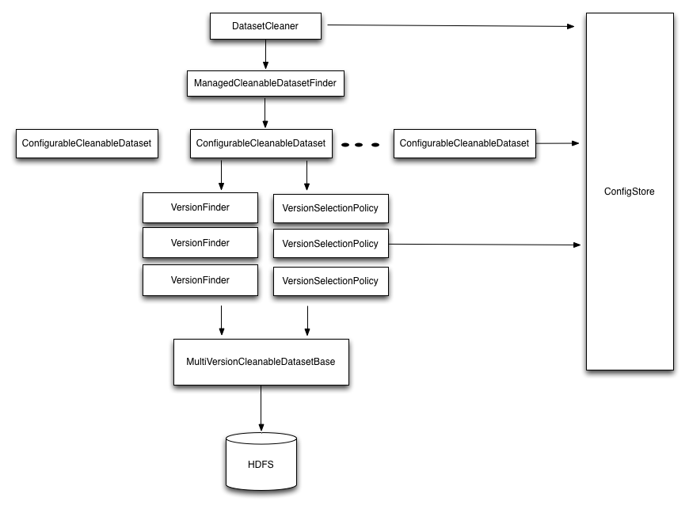

#Table Of Contents
[TOC]
#Introduction
Gobblin retention management is a framework to manage the retention of Hadoop datasets. The system allows users to configure retention policies for individual datasets using the Gobblin config store. This framework gives the flexibility to associate retention configurations both at a dataset level and a cluster level.
For HDFS datasets, the framework comes with several standard policies like timebased policy, policy to retain top k files in a dataset and many more. It also has in-built support for standard data layouts like daily/hourly paritioned data and snapshot data. Gobblin retention management supports several retention actions. The most basic action is deleting files that satisfy a policy. Gobblin also supports actions like access control which set permissions on files that satisfy a policy.

# Design
The design has two parts. First part describes the contructs like dataset finders, version finders and policies. Second part describes the configuration aspects of gobblin retention management.

## Overview of Gobblin Config Management Library
To support all the retention configuration requirements, we use Gobblin Dataset Config Management library.This is a short overview. In the gobblin code base it can be found in the module ```gobblin-config-management```

The Gobblin Dataset Config Management Library is a library for storing, managing and accessing configuration. The library is an extension to TypeSafe Config with additional features like dataset awareness and tags.

The library provides a mapping from a config key to a config object. Each config key is represented through a URI. The config object is a map from property name to a property value.

A config key K can import one or more config keys I1, I2, ... . The config key K will inherit any properties from I1, I2, … that are not defined in K. The inheritance is resolved in the order of the keys I1, I2, … etc., i.e. the property will be resolved to the value in the last Im that defines the property. Applications can create tags T1, T2 etc and import them explicitly in K.

We also use the path in the config key URI for implicit tagging. For example, /trackingData/someEvent implicitly imports which /trackingData which implicitly imports /.

**ConfigClient** - The client APIs that an application uses to interact with the library

**ConfigLibrary** - Core implementation that stores the topology of configs in the store. Business logic such as substitution resolution and interpolation of configs happen here.

**ConfigStore** - The physical store for all the configs and tags. Currently a HDFS based
ConfigStore is implemented but other physical stores can be implemented

## Retention Constructs


### DatasetCleaner
The ```DatasetCleaner``` is the retention runner. The class takes in job properites as key value pairs. A single ```DatasetCleaner``` can manage retention for different kinds of datasets. Each kind of dataset gets its own ```DatasetFinder```. ```DatasetCleaner``` is responsible for instantiating all the ```DatasetFinder```s. For each ```DatasetFinder``` it finds all the ```CleanableDataset```s and calls the ```CleanableDataset.clean()``` method to delete data.

To instantiate all the dataset finders, it uses the ```gobblin.retention.tag``` job property. This is a comma seperated list of tag URIs in the ```ConfigStore```. A ```DatasetFinder``` will be created for every dataset that imports any of these tags.

For instance let's say we have a all the event based datasets at ```/datasets/trackingData``` in the ```ConfigStore``` and it is tagged with a tag ```/tags/retention/TimeBased```. When ```gobblin.retention.tag``` is set to ```/tags/retention/TimeBased```. All datasets that are tagged with ```/tags/retention/TimeBased``` in the ```ConfigStore``` will be processed by this retention job. So in this case a ```DatasetFinder``` will be created for ```/datasets/trackingData```. More details about the ```ConfigStore``` in [Retention Configuration](#Retention Configuration) section.

### DatasetFinder
A ```DatasetFinder ``` is an interface to find all ```CleanableDataset```s

### ManagedCleanableDatasetFinder
This is the most basic implementation of a ```DatasetFinder``` that extends a ```ConfigurableGlobDatasetFinder``` to find HDFS datasets based on a glob pattern. It uses the ```ConfigClient``` to connect to the ```ConfigStore``` and get the dataset specific configs for each dataset found.

### ConfigurableCleanableDataset
The ```ManagedCleanableDatasetFinder``` instantiates a ```ConfigurableClenableDataset``` for every match in the glob pattern. This class reads the dataset config to instatiate a list of ```VersionFinder``` and ```VersionSelectionPolicy``` pairs. The Retention Configuration section provides details on config keys used to specify the ```VersionFinder``` and ```VersionSelectionPolicy``` classes.

### VersionFinder
A version is defined as a deletable entity (or a path) in a dataset. A version can either be retained or deleted. The ```VersionFinder``` finds all the versions of a dataset.

### VersionSelectionPolicy
A predicate to select subset of versions from the list of all version discovered by the `VersionFinder`. By default all the versions selected by the ```VersionSelectionPolicy``` will be **deleted**. Apart from delete, gobblin also provides other `RetentionAction`s on the selected versions.

### RetentionAction
An abstraction for the kind of action to be performed on all the versions discoverd by the ```VersionFinder``` or a subset of versions filtered by the ```VersionSelectionPolicy```. Delete is the default action on selected versions. Gobblin also supports ```AccessControlAction``` which sets permissions on selected versions.

## Retention Configuration
Gobblin Retention is configured through Gobblin config management. All dataset configs are stored in a config store that can be accessed through a ```ConfigClient```. The gobblin config management uses [TypeSafe Config](https://github.com/typesafehub/config). The language used is [HOCON](https://github.com/typesafehub/config/blob/master/HOCON.md#hocon-human-optimized-config-object-notation), a more readable JSON superset.

The gobblin config management library allows any implementation of config store but for the scope of this document we assume a HDFS based ConfigStore that stores dataset configs in files on HDFS.

Let us take an example ConfigStore instance on HDFS as below.

<pre>
├── _CONFIG_STORE
   └── 2.0
       ├── data
       │   └── events
       │      └── main.conf
       │      └── includes.conf
       │          ├── loginEvent
       │             └── main.conf
       │             └── includes.conf
       ├── tags
          └── retention
            └── main.conf
                 ├── timebased
                    └── main.conf

</pre>

Every config store has a store root directory named ```_CONFIG_STORE```. Each new deployment of a store creates a new version (2.0 shown above). Each directory in the store may have a main.conf file and an includes.conf file. The main.conf file holds the config key/value pairs. And includes.conf are used to import other directory paths in the same store. For instance, ```_CONFIG_STORE/2.0/data/events``` can import ```/tags/retention``` in its includes.conf file. All the key value pairs in ```/tags/retention/main.conf``` are automatically imported into ```/data/events```.

Note that the directory structure under the configStore correspond to the direcctory structure of data on HDFS. In this case ```hdfs://data/events/loginEvent```'s retention configs are at ```hdfs://_CONFIG_STORE/2.0/data/events/loginEvent/main.conf``` in the config store.

### Tags
For maintainability and reusablity we define all the configs as tags and import them into the dataset.

- Below is a sample timebased retention tag, ```/tags/retention/timebased/main.conf```

<pre>

gobblin.retention : {

    ##Alias
    TimeBasedSelectionPolicy=org.apache.gobblin.data.management.policy.SelectBeforeTimeBasedPolicy
    DateTimeDatasetVersionFinder=org.apache.gobblin.data.management.version.finder.DateTimeDatasetVersionFinder

    dataset : {
      finder.class=org.apache.gobblin.data.management.retention.profile.ManagedCleanableDatasetFinder
      partitions=[${gobblin.retention.daily}
    }

    daily : {
      selection {
        policy.class = ${gobblin.retention.TimeBasedSelectionPolicy}
        timeBased.lookbackTime=1000d
      }
      version : {
        finder.class=${gobblin.retention.DateTimeDatasetVersionFinder}
        globPattern = "daily/*/*/*"
        datetime.pattern = "yyyy/MM/dd"
      }
    }
}
</pre>

- To apply this retention config to ```hdfs://data/events``` the tag ```/tags/retention/timeBased``` can be imported by ```_CONFIG_STORE/2.0/data/events/includes.conf``` shown below.

<pre>
###### Include files for /data/events ######
tags/retention/timeBased
</pre>

- ```_CONFIG_STORE/2.0/data/events/includes.conf``` Will have the configs specific to ```data/events``` shown below.

<pre>
##### Common configs for all of /data/events ######
# Glob pattern to use to find datasets
gobblin.dataset.pattern = "/data/events/*"
</pre>

Similarly the same tag ```/tags/retention/timebased``` can be imported by other datasets as well.

### Dataset overrides
By default all the event datasets under ```hdfs://data/events``` get the configs from ```_CONFIG_STORE/2.0/data/events``` but sometimes it becomes necessary to override the retention for a specific dataset under ```hdfs://data/events```. This can be done by creating a directory under ```_CONFIG_STORE/2.0/data/events``` with the name of dataset and overriding config keys. For instance if we want retention of 1d for ```loginEvent``` we can create ```_CONFIG_STORE/2.0/data/events/loginEvent/main.conf``` as below.
All other event datasets will have the default retention of 1000d.

<pre>
gobblin.retention : {
    daily : {
      selection {
        timeBased.lookbackTime=1d
      }
    }
}
</pre>

### Examples
Browse the [gobblin-data-management/config-example](/gobblin-data-management/config-example) directory to see example configuration.

## Supported Retention Configurations
Below is a list of ready to use supported retention configurations. But users can always implement their own ```DatasetFinder```,```VersionFinder``` and ```VersionSelectionPolicy``` and plug it in.

### 1. Time based retention
To delete data older than some time

<pre>
gobblin.retention : {

    dataset : {
      pattern="/user/gobblin/*"
      finder.class=org.apache.gobblin.data.management.retention.profile.ManagedCleanableDatasetFinder
    }

    selection : {
      policy.class=org.apache.gobblin.data.management.policy.SelectBeforeTimeBasedPolicy
      timeBased.lookbackTime=7d
    }

    version : {
      finder.class=org.apache.gobblin.data.management.version.finder.GlobModTimeDatasetVersionFinder
    }
}
</pre>

### 2. Newest K retention
To always keep k new versions and delete the rest

<pre>
gobblin.retention : {

    dataset : {
      pattern="/user/gobblin/*"
      finder.class=org.apache.gobblin.data.management.retention.profile.ManagedCleanableDatasetFinder
    }

    selection : {
      policy.class=org.apache.gobblin.data.management.policy.NewestKSelectionPolicy
      newestK.versionsNotSelected=2
    }

    version : {
      finder.class=org.apache.gobblin.data.management.version.finder.GlobModTimeDatasetVersionFinder
    }
}
</pre>

### 3. Combining multiple policies
The below config deletes versions older than 3 days but making sure we always have at least 2 version. So if we have only 1 version and it is 4 days old it is not deleted.

<pre>
gobblin.retention : {

    dataset : {
      pattern="/user/gobblin/snapshots/*/*"
      finder.class=org.apache.gobblin.data.management.retention.profile.ManagedCleanableDatasetFinder
    }

    selection : {
      policy.class=org.apache.gobblin.data.management.policy.CombineSelectionPolicy
      combine.operation=INTERSECT
      combine.policy.classes=[
        org.apache.gobblin.data.management.policy.SelectBeforeTimeBasedPolicy,
        org.apache.gobblin.data.management.policy.NewestKSelectionPolicy
      ]
      timeBased.lookbackTime=3d
      newestK.versionsNotSelected=2

    }

    version : {
      finder.class=org.apache.gobblin.data.management.version.finder.GlobModTimeDatasetVersionFinder
    }
}
</pre>

### 4. Datasets with multiple kinds of versions
This is mostly useful for retention management of datasets that have different kinds of versions with each having their own policies. For example an event dataset may have daily and hourly partitions. For daily we may want a higher retention of 5 days but hourly the retention may be set to 2 days.

<pre>
gobblin.retention : {

    TimeBasedSelectionPolicy=org.apache.gobblin.data.management.policy.SelectBeforeTimeBasedPolicy
    DateTimeDatasetVersionFinder=org.apache.gobblin.data.management.version.finder.DateTimeDatasetVersionFinder

    dataset : {
      pattern="/user/gobblin/data/*"
      finder.class=org.apache.gobblin.data.management.retention.profile.ManagedCleanableDatasetFinder
      partitions=[${gobblin.retention.hourly}, ${gobblin.retention.daily}]
    }

    daily : {
      selection {
        policy.class = ${gobblin.retention.TimeBasedSelectionPolicy}
        timeBased.lookbackTime = 5d
      }
      version : {
        finder.class=${gobblin.retention.DateTimeDatasetVersionFinder}
        globPattern = "daily/*/*/*"
        datetime.pattern = "yyyy/MM/dd"
      }
    }

    hourly : {
      selection {
        policy.class = ${gobblin.retention.TimeBasedSelectionPolicy}
        timeBased.lookbackTime = 2d
      }
      version : {
        finder.class=${gobblin.retention.DateTimeDatasetVersionFinder}
        globPattern = "hourly/*/*/*/*"
        datetime.pattern = "yyyy/MM/dd/hh"
      }
  }
}

</pre>


### 5. Time based Hive Retention
Gobblin supports retention for a hive partitioned table. Partitions older than n days can be dropped using this policy. A job can optionally choose to delete data associated with the partition. By default the job does NOT delete data. It only drops the hive partition.

<pre>

gobblin.retention : {

    is.blacklisted=false

    dataset : {
      finder.class=org.apache.gobblin.data.management.retention.dataset.finder.CleanableHiveDatasetFinder
    }

    selection : {
      policy.class=org.apache.gobblin.data.management.policy.SelectBeforeTimeBasedPolicy

      ## Partitions older than 3 days will be deleted
      timeBased.lookbackTime=3d
    }

    version.finder.class=org.apache.gobblin.data.management.version.finder.DatePartitionHiveVersionFinder

    hive {
      partition {
        key.name=datepartition
        value.datetime.pattern=yyyy-MM-dd-HH
      }
    }
}

</pre>

Job level configuration to enable data deletion
<pre>
gobblin.retention.hive.shouldDeleteData=true
</pre>

### 6. Setting permissions/owner/group for versions of a dataset
Gobblin retention can set permissions, change owner/group for certain versions of a dataset. The below configuration is an extention to example #4, where along with deleting daily versions older than 5 days, it also restricts the access for daily versions older than 4 days to owner only.
All the access control policies to apply are discovered through the key ```accessControl.policies```. The below example shows one such policy called ```ownerOnly```. Users can define any arbitrary policy and add them to ```accessControl.policies```.

<pre>
gobblin.retention : {

    TimeBasedSelectionPolicy=org.apache.gobblin.data.management.policy.SelectBeforeTimeBasedPolicy
    DateTimeDatasetVersionFinder=org.apache.gobblin.data.management.version.finder.DateTimeDatasetVersionFinder

    dataset : {
      pattern="/user/gobblin/data/*"
      finder.class=org.apache.gobblin.data.management.retention.profile.ManagedCleanableDatasetFinder
      partitions=[${gobblin.retention.hourly}, ${gobblin.retention.daily}]
    }

    daily : {
      selection {
        policy.class = ${gobblin.retention.TimeBasedSelectionPolicy}
        timeBased.lookbackTime = 5d
      }
      version : {
        finder.class=${gobblin.retention.DateTimeDatasetVersionFinder}
        globPattern = "daily/*/*/*"
        datetime.pattern = "yyyy/MM/dd"
      }
      accessControl {

            ## Provide a list of comma separated policies to apply. Each entry in this list should have a corresponding config section.
            policies = [ownerOnly]

            ownerOnly {
                 selection {
                    policy.class = ${gobblin.retention.TimeBasedSelectionPolicy}
                    timeBased.lookbackTime=4d
                 }
                 mode : 700
                 user : myUser
                 group : noAccess
            }
        }
    }

    hourly : {
      selection {
        policy.class = ${gobblin.retention.TimeBasedSelectionPolicy}
        timeBased.lookbackTime = 2d
      }
      version : {
        finder.class=${gobblin.retention.DateTimeDatasetVersionFinder}
        globPattern = "hourly/*/*/*/*"
        datetime.pattern = "yyyy/MM/dd/hh"
      }
  }
}

</pre>
