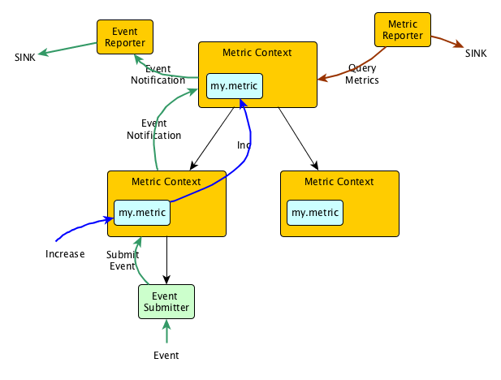

Table of Contents
-----------------

[TOC]

Metric Context
==============

Metric contexts are organized hierarchically in a tree. Each metric context has a set of Tags, each of which is just key-value pair. The keys of all tags are strings, while the values are allowed to be of any type. However, most reporters will serialize the tag values using their `toString()` method.

Children contexts automatically inherit the tags of their parent context, and can add more tags, or override tags present in the parent. Tags can only be defined during construction of each metric context, and are immutable afterwards. This simplifies the inheritance and overriding of metrics. 

Metric Contexts are created using `MetricContext.Builder`, which allows adding tags and specifying the parent. This is the only time tags can be added to the context. When building, the tags of the parent and the new tags are merged to obtain the final tags for this context. When building a child context for Metric Context `context`, calling `context.childBuilder(String)` generates a Builder with the correct parent.

Each metric context contains the following instance variables:

* A `String` `name`. The name is not used by the core metrics engine, but can be accessed by users to identify the context.
* A reference to the parent metric context, or null if it has no parent.
* A list of children metric context references, stored as soft references.
* An object of type [Tagged](https://github.com/apache/gobblin/blob/master/gobblin-metrics-libs/gobblin-metrics-base/src/main/java/org/apache/gobblin/metrics/Tagged.java) containing the tags for this metric context.
* A `Set` of notification targets. Notification targets are objects of type [Function](https://google.github.io/guava/releases/15.0/api/docs/com/google/common/base/Function.html)<[Notification](https://github.com/apache/gobblin/blob/master/gobblin-metrics-libs/gobblin-metrics-base/src/main/java/org/apache/gobblin/metrics/notification/Notification.java), Void> which are all called every time there is a new notification. Notifications can be submitted to the Metric Context using the method `sendNotification(Notification)`. Notification targets can be added using `addNotificationTarget(Function<Notification, Void>)`.
* A lazily instantiated `ExecutorService` used for asynchronously executing the notification targets. The executor service will only be started the first time there is a notification and the number of notification targets is positive.
* A `ConcurrentMap` from metric names to `Metric` for all metrics registered in this Metric Context. Metrics can be added to this map using the `register(Metric)`, `register(String, Metric)`, or `registerAll(MetricSet)`, although it is recommended to instead use the methods to create and register the metrics. Metric Context implements getter methods for all metrics, as well as for each type of metric individually (`getMetrics`, `getGauges`, `getCounters`, `getHistograms`, `getMeters`, `getTimers`).

Metrics
=======

All metrics extend the interface [ContextAwareMetric](https://github.com/apache/gobblin/blob/master/gobblin-metrics-libs/gobblin-metrics-base/src/main/java/org/apache/gobblin/metrics/ContextAwareMetric.java). Each metric type in Dropwizard Metrics is extended to a Context Aware type: `ContextAwareCounter`, `ContextAwareGauge`, `ContextAwareHistogram`, `ContextAwareMeter`, `ContextAwareTimer`.

Context Aware metrics all always created from the Metric Context where they will be registered. For example, to get a counter under Metric Context `context`, the user would call `context.counter("counter.name")`. This method first checks all registered metrics in the Metric Context to find a counter with that name, if it succeeds, it simply returns that counter. If a counter with that name has not been registered in `context`, then a new `ContextAwareCounter` is created and registered in `context`.

On creation, each Context Aware metric (except Gauges) checks if its parent Metric Context has parents itself. If so, then it automatically creates a metric of the same type, with the same name, in that parent. This will be repeated recursively until, at the end, all ancestor Metric Contexts will all contain a context aware metric of the same type and with the same name. Every time the context aware metric is updated, the metric will automatically call the same update method, with the same update value, for its parent metric. Again, this will continue recursively until the corresponding metrics in all ancestor metric contexts are updated by the same value. If multiple children of a metric context `context` all have metrics with the same name, when either of them is updated, the corresponding metric in `context` will also get updated. In this way, the corresponding metric in `context` will aggregate all updated to the metrics in the children context.

Users can also register objects of type `com.codahale.metrics.Metric` with any Metric Context, but they will not be auto-aggregated.

Events
======

Events are objects of type [GobblinTrackingEvent](https://github.com/apache/gobblin/blob/master/gobblin-metrics-libs/gobblin-metrics-base/src/main/avro/GobblinTrackingEvent.avsc), which is a type generated from an Avro schema. Events have:

* A `namespace`.
* A `name`.
* A `timestamp`.
* A `Map<String,String>` of `metadata`.

Events are submitted using the `MetricContext#submitEvent(GobblinTrackingEvent)` method. When called, this method packages the event into an [EventNotification](https://github.com/apache/gobblin/blob/master/gobblin-metrics-libs/gobblin-metrics-base/src/main/java/org/apache/gobblin/metrics/notification/EventNotification.java) and submits it to the metric context using the method `MetricContext#sendNotification(Notification)`. This notification is passed to all metrics context ancestors. Each notification target of each ancestor metric context will receive the EventNotification. Events are not stored by any Metric Context, so the notification targets need to handle these events appropriately.

Events can be created manually using Avro constructors, and using the method `context.submitEvent(GobblinTrackinEvent)`, but this is unfriendly when trying to build events incrementally, especially when using metadata. To address this, users can instead use [EventSubmitter](https://github.com/apache/gobblin/blob/master/gobblin-metrics-libs/gobblin-metrics-base/src/main/java/org/apache/gobblin/metrics/event/EventSubmitter.java) which is an abstraction around the Avro constructor for GobblinTrackingEvent.

Event Submitter
---------------

An event submitter is created using an `EventSubmitter.Builder`. It is associated with a Metric Context where it will submit all events, and it contains a `namespace` and default `metadata` that will be applied to all events generated through the event submitter. The user can then call `EventSubmitter#submit` which will package the event with the provided metadata and submit it to the Metric Context.

Reporters
=========

Reporters export the metrics and/or events of a metric context to a sink. Reporters extend the interface `com.codahale.metrics.Reporter`. Most reporters will attach themselves to a Metric Context. The reporter can then navigate the Metric Context tree where the Metric Context belongs, get tags and metrics, get notified of events, and export them to the sink.

The two best entry points for developing reporters are [RecursiveScheduledMetricReporter](https://github.com/apache/gobblin/blob/master/gobblin-metrics-libs/gobblin-metrics-base/src/main/java/org/apache/gobblin/metrics/reporter/RecursiveScheduledMetricReporter.java) and [EventReporter](https://github.com/apache/gobblin/blob/master/gobblin-metrics-libs/gobblin-metrics-base/src/main/java/org/apache/gobblin/metrics/reporter/EventReporter.java). These classes do most of the heavy lifting for reporting metrics and events respectively. They are both scheduled reporters, meaning the will export their metrics / events following a configurable schedule.

RecursiveScheduleMetricReporter
-------------------------------

This abstract reporter base is used for emitting metrics on a schedule. The reporter, on creation, is attached to a particular Metric Report. Every time the reporter is required to emit events, the reporter selects the attached Metric Context and all descendant Metric Contexts. For each of these metric contexts, it queries the Metric Context for all metrics, filtered by an optional user supplied filter, and then calls `RecursiveScheduledMetricReporter#report`, providing the method with all appropriate metrics and tags. Developers need only implement the report method.

EventReporter
-------------

This abstract reporter base is used for emitting events. The EventReporter, on creation, takes a Metric Context it should listen to. It registers a callback function as a notification target for that Metric Context. Every time the callback is called, if the notification is of type `EventNotification`, the EventReporter unpacks the event and adds it to a `LinkedBlockingQueue` of events.

On a configurable schedule, the event reporter calls the abstract method `EventReporter#reportEventQueue(Queue<GobblinTrackingEvent>)`, which should be implemented by the concrete subclass. To keep memory limited, the event queue has a maximum size. Whenever the queue reaches a size 2/3 of the maximum size, `EventReporter#reportEventQueue` is called immediately.
