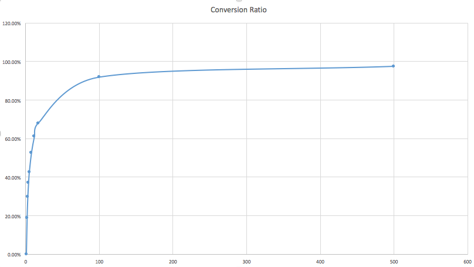

# Table of Contents

[TOC]

#Introduction
The Google Search Console data ingestion project is to download query and analytics data from Google Search Console for the purpose of doing search analytics of your verified sites. Available analytics measures are clicks, impressions, CTR and position. Used dimensions are dates, pages, countries and queries. 

Details about this Google service and API can be found at [https://developers.google.com/webmaster-tools/](http://).This service can be run on a daily or weekly basis to download data at a daily granularity. 

Other useful links:

* API Java documentation: [https://developers.google.com/resources/api-libraries/documentation/webmasters/v3/java/latest/](http://)

* Google API Manager: [https://console.developers.google.com/apis/dashboard](http://)

#Implementation
##Summary
This connector implements sources, extractors, and iterators for the extractors, where each iterator is responsible for downloading data of each market. Due to the limitations of the Google API, the whole service has to deal with a lot of asynchronous API calls to figure out the problems like

* what is the total size of all unique pages
* what is the full list of all unique pages
* how to download queries and analytics data for each page
* how to improve the overall performance

There are two implementations for this service to download analytics data for each page, V1 and V2. V1 is the initial design, which is very straight forward. After we get a full list of all unique URL pages, we send a request for the queries and analytics data for that page with a page filter saying that the page needs to exactly equals that page. However, if the amount of pages is large, for example, above 100,000 pages; given the actual API request speed(less than 4 pages/second), the amount of time to process all pages can easily go beyond 10 hours. So a faster version is in demand, the V2, which is to send requests based on tries. This greatly reduces the amount of requests that need to be sent. The idea is to group a bunch of pages sharing the common prefix together and send just one request for that page group by utilizing the page filter that contains the common prefix. In order to achieve this, we first need to save all pages into a URL trie and then implement a trie iterator to iterate through the trie to return groups of pages based on a group size. This new implementation can easily improve the performance by over 40 times. This graph can visually explain how the performance gain is achieved.

In short, large group size can convert large percentage of pages into groups, each of which results in a single API call.

The user still has the ability to choose which algorithm or implementation to use when starting the service by configuring the key `source.google_webmasters.request.tuning.get_queries.apply_trie`.

##Entities
Here is a table explaining the responsibility of each class briefly

Name     | Description
-------- | ---
GoogleWebmasterClient | GoogleWebmasterClient provides basic accesses to Google Search Console by utilizing Google Webmaster API.
GoogleWebmasterDataFetcher | GoogleWebmasterDataFetcher implements the features to get all pages, and download analytics data (e.g. queries, clicks, impressions, CTR, position) for a given set of constraints like dates, pages, and countries.
GoogleWebmasterFilter | This is a util class providing enums and utility functions relevant to Google webmaster filters.
GoogleWebMasterSource | This is an abstract class that extends Gobblin's standard QueryBasedSource. It provides basic checks and configuration processing for google-webmaster-pull configuration files.
GoogleWebMasterSourceDaily | This implementation gives you the ability to do a daily extract from Google Search Console.
GoogleWebmasterExtractor | An implementation of Gobblin's extractor. 
 It relies on a bunch of GoogleWebmasterExtractorIterator generated for each market to extract the data.

GoogleWebmasterExtractorIterator | The core piece used by GoogleWebmasterExtractor to iterate through the downloaded dataset.
GoogleWebmasterDayPartitioner | The output partitioner that partitions output by the date of fetched data set
ProducerJob | This is a partitionable request unit used by GoogleWebmasterExtractorIterator for sending detailed API requests to Google Search Console. It includes the filter dimensions like date range, page URL and page URL filter type(e.g. contains, non-contains, equals). These jobs are generated in a producer thread while requesting queries and analytics data for pages. They are placed into a ConcurrentLinkedDeque and dispatched or processed by a pool of working threads. The downloaded data will be put into a LinkedBlockingDeque which is shared with the GoogleWebmasterExtractorIterator. GoogleWebmasterExtractorIterator will then pass the data to GoogleWebmasterExtractor, and then to the rest of the Gobblin framework. 
 It is an abstract class and currently has two implementations, SimpleProducerJob and TrieBasedProducerJob.
 It provides the default logic about how to partition a ProducerJob. When this producer job has a date range, then divide the job evenly into two minor producer jobs covering the original date range; otherwise, this producer job is not partitionable.
SimpleProducerJob | SimpleProducerJob is a basic implementation of ProducerJob, utilizing the default partition logic.
TrieBasedProducerJob | TrieBasedProducerJob is a trie-based implementation of ProducerJob. 
 For the partition logic, it first tries to partition the pages by splitting the trie into smaller ones based on a new group size, which is a half of previous value. When it is not partitionable at the page level, the parition logic falls back to the default one provided by the base class.

UrlTrie | The trie that keeps all URL pages. Save all fetched pages into a trie in order to use the TrieBasedProducerJobs
UrlTrieNode | The trie node in the URL trie
UrlTriePostOrderIterator | This is a post-order iterator that traverses the nodes on the URL trie with a stopping rule, which is, it will not go deeper into the nodes whose size(defined as the number of descendant URLs and itself if itself is a URL page) is less than or equal to the stopping size. In other words, those nodes with size less than or equal to the stopping size will be treated as leaf nodes.
UrlTriePrefixGrouper | UrlTriePrefixGrouper will package the URL pages/nodes into groups given the group size while traversing the UrlTrie by utilizing a TrieIterator. If the current node is not a "leaf" node defined by the TrieIterator, then a "fake" group of size 1 will be created by only including this node. 
 A group of URL pages will share the same common longest prefix and will be sent in one API request by using the "containing" page filter. A fake group containing only one page uses the "equals" page filter.

##Work Flow
Starting with GoogleWebMasterSource, it consumes the job or pull configuration file, does some basic checks, and decides the date range to work on based on the type of GoogleWebMasterSource specified. Then it passes the date range and the list of markets to GoogleWebmasterExtractor to work on. The GoogleWebmasterExtractor will create a GoogleWebmasterExtractorIterator for each market and start the downloading process, which is the same for every market. For the downloading process, firstly, it figures out the size of the unique URL pages by utilizing GoogleWebmasterDataFetcher and GoogleWebmasterClient. Then it tries to get all unique pages and give warnings if not all pages can be found. Based on the version or underlying algorithm the user chooses to use, GoogleWebmasterExtractorIterator starts downloading queries and analytics data for each page and pass the data back to GoogleWebmasterExtractor in an asynchronous mode.

#Configuration

Configuration Key | Default Value | Description
----------------- | ------------- | ---
source.google_webmasters.property_url|Must Provide|Provide the property site URL whose google search analytics data you want to download
source.google_webmasters.request.filters|Optional|The filters that will be passed to all your API requests. 
 Filter format is [GoogleWebmasterFilter.Dimension].[DimensionValue].
Currently, this filter operator is "EQUALS" and only Country dimension is supported. Will extend this feature according to more use cases in the future.
source.google_webmasters.request.dimensions|Must Provide|Allowed dimensions are DATE, PAGE, COUNTRY, QUERY, DEVICE, SEARCH_TYPE, SEARCH_APPEARANCE
source.google_webmasters.request.metrics|Must Provide|Allowed metrics are CLICKS, IMPRESSIONS, CTR, POSITION
source.google_webmasters.request.page_limit|5000|The response row limits when you ask for pages. Set it to 5000 when you want to get all pages. Default to 5000, which is the maximum allowed.
source.google_webmasters.request.query_limit|5000|The response row limits when you ask for queries. Default to 5000, which is the maximum allowed.
source.google_webmasters.request.hot_start|Optional|Hot start this service with pre-set pages. Once this is set, the service will ignore source.google_webmasters.request.page_limit, and won't get all pages, but use the pre-set pages instead. 
 This is useful for debugging or resuming your failed work.

source.google_webmasters.request.tuning.get_queries.time_out|120|Set the time out in minutes for each round.
source.google_webmasters.request.tuning.get_queries.max_retries|30|Tune the maximum rounds of retries allowed when API calls failed because of exceeding quota.
source.google_webmasters.request.tuning.get_queries.cool_down_time|250|Tune the cool down time in millisecond between each round.
source.google_webmasters.request.tuning.get_queries.batches_per_second|2.25|Tune the speed of API requests in batches
source.google_webmasters.request.tuning.get_queries.batch_size|2|Tune the size of a batch. Batch API calls together to reduce the number of HTTP connections. 
 Note: A set of n requests batched together counts toward your usage limit as n requests, not as one request. The batch request is taken apart into a set of requests before processing.
Read more at [https://developers.google.com/webmaster-tools/v3/how-tos/batch](http://).
source.google_webmasters.request.tuning.get_queries.trie_group_size|500|Set the group size for the URL trie
source.google_webmasters.request.tuning.get_queries.apply_trie|false|Set to true to use the Trie based algorithm. Otherwise, set to false.
 If set to true, you also need to set page_limit to 5000 indicating that you want to get all pages because trie based algorithm won't give you expected results if you just need a subset of all pages.

source.google_webmasters.request.tuning.get_pages.requests_per_second|5.0|Tune the speed of API requests while getting all pages.
source.google_webmasters.request.tuning.get_pages.max_retries|120|Tune the number of maximum retries while getting all pages. Consider the following affecting factors while setting this number: <ol><li>the length of shared prefix path may be very long.</li><li>the Quota Exceeded exception.</li></ol>
source.google_webmasters.request.tuning.get_pages.time_out|2|Set the time out in minutes while getting all pages.

