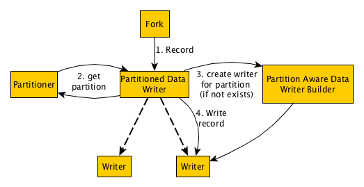

Table of Contents
-----------------

[TOC]

Gobblin allows partitioning output data using a writer partitioner. This allows, for example, to write timestamped records to a different file depending on the timestamp of the record.

To partition output records, two things are needed:

* Set `writer.builder.class` to a class that implements `PartitionAwareDataWriterBuilder`.
* Set `writer.partitioner.class` to the class of the desired partitioner, which must be subclass of `WriterPartitioner`. The partitioner will get all Gobblin configuration options, so some partitioners may require additional configurations.

If `writer.partitioner.class` is set but `writer.builder.class` is not a `PartitionAwareDataWriterBuilder`, Gobblin will throw an error. If `writer.builder.class` is a `PartitionAwareDataWriterBuilder`, but no partitioner is set, Gobblin will attempt to still create the writer with no partition, however, the writer may not support unpartitioned data, in which case it will throw an error.

`WriterPartitioner`s compute a partition key for each record. Some `PartitionAwareDataWriterBuilder` are unable to handle certain partition keys (for example, a writer that can only partition by date would expect a partition schema that only contains date information). If the writer cannot handle the partitioner key, Gobblin will throw an error. The Javadoc of partitioners should always include the schema it emits and the writer Javadoc should contain which schemas it accepts for ease of use.

Existing Partition Aware Writers
--------------------------------
* `gobblin.writer.AvroDataWriterBuilder`: If partition is present, creates directory structure based on partition. For example, if partition is `{name="foo", type="bar"}`, the record will be written to a file in directory `/path/to/data/name=foo/type=bar/file.avro`.  

Existing Partitioners
---------------------
* `gobblin.example.wikipedia.WikipediaPartitioner`: Sample partitioner for the Wikipedia example. Partitions record by article title.

Design
------


Gobblin always instantiates a `PartitionedDataWriter` for each fork. On construction, the partitioned writer:

 1. checks whether a partitioner is present in the configuration. If no partitioner is present, then the instance of `PartitionedDataWriter` is simply a thin wrapper around a normal writer. 
 2. If a partitioner is present, the partitioned writer will check if the class configured at `writer.builder.class` is an instance of `PartitionAwareDataWriterBuilder`, throwing an error in case this is not true.  
 3. The partitioned writer instantiate the partitioner, runs `partitionSchema()`, and then checks whether the partition aware writer builder accepts that schema using `validatePartitionSchema`. If this returns false, Gobblin will throw an error.

Every time the partitioned writer gets a record, it uses the partitioner to get a partition key for that record. The partitioned writer keeps an internal map from partition key to instances of writers for each partition. If a writer is already created for this key, it will call write on that writer for the new record. If the writer is not present, the partitioned writer will instantiate a new writer with the computed partition, and then pass in the record.

`WriterPartitioner` partitions records by returning a partition key for each record, which is of type `GenericRecord`. Each `WriterPartitioner` emits keys with a particular `Schema` which is available by using the method `WriterPartitioner#partitionSchema()`. Implementations of `PartitionAwareDataWriterBuilder` must check the partition schema to decide if they can understand and correctly handle that schema when the method `PartitionAwareDataWriterBuilder#validateSchema` is called (for example, a writer that can only partition by date would expect a partition schema that only contains date information). If the writer rejects the partition schema, then Gobblin will throw an error before writing anything.

Implementing a partitioner
--------------------------

The interface for a partitioner is

```java
/**
 * Partitions records in the writer phase.
 */
public interface WriterPartitioner<D> {
  /**
   * @return The schema that {@link GenericRecord} returned by {@link #partitionForRecord} will have.
   */
  public Schema partitionSchema();

  /**
   * Returns the partition that the input record belongs to. If
   * partitionFoRecord(record1).equals(partitionForRecord(record2)), then record1 and record2
   * belong to the same partition.
   * @param record input to compute partition for.
   * @return {@link GenericRecord} representing partition record belongs to.
   */
  public GenericRecord partitionForRecord(D record);
}
```

For an example of a partitioner implementation see `gobblin.example.wikipedia.WikipediaPartitioner`.

Each class that implements `WriterPartitioner` is required to have a public constructor with signature `(State state, int numBranches, int branchId)`.

Implementing a Partition Aware Writer Builder
---------------------------------------------

This is very similar to a regular `DataWriterBuilder`, with two differences:

* You must implement the method `validatePartitionSchema(Schema)` that must return false unless the builder can handle that schema.
* The field `partition` is available, which is a `GenericRecord` that contains the partition key for the built writer. For any two different keys, Gobblin may create a writer for each key, so it is important that writers for different keys do not collide (e.g. do not try to use the same path).

For an example of a simple `PartitionAwareWriterBuilder` see `gobblin.writer.AvroDataWriterBuilder`.
