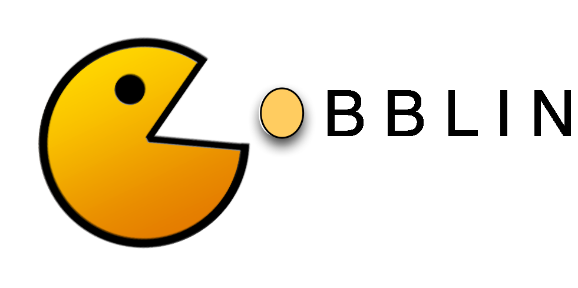

  A few companies known to be powered by Gobblin:
  <ul>
    <li><a href="http://www.linkedin.com" target="_blank"><b>LinkedIn</b></a></li>
    <li><a href="http://www.intel.com" target="_blank"><b>Intel</b></a></li>
    <li><a href="http://www.paypal.com" target="_blank"><b>Paypal</b></a></li>
    <li><a href="http://www.microsoft.com" target="_blank"><b>Microsoft</b></a></li>
    <li><a href="http://www.ibm.com" target="_blank"><b>IBM</b></a></li>
    <li><a href="http://www.home.cern/" target="_blank"><b>CERN</b></a></li>
    <li><a href="http://www.apple.com/" target="_blank"><b>Apple</b></a></li>
    <li><a href="http://www.stunlockstudios.com" target="_blank"><b>Stunlock Studios</b></a></li>
    <li><a href="http://www.swisscom.ch" target="_blank"><b>Swisscom</b></a></li>
    <li><a href="http://www.prezi.com" target="_blank"><b>Prezi</b></a></li>
    <li><a href="http://www.cleverleaf.co.uk" target="_blank"><b>Cleverdata</b></a></li>
    <li><a href="http://www.applift.com" target="_blank"><b>AppLift</b></a></li>
    <li><a href="http://www.nerdwallet.com" target="_blank"><b>Nerdwallet</b></a></li>
    <li><a href="http://www.sandia.gov/" target="_blank"><b>Sandia National Laboratories</b></a></li>
    <li><a href="http://www.bpuholdings.com/" target="_blank"><b>BPU Holdings</b></a></li>
  </ul>

